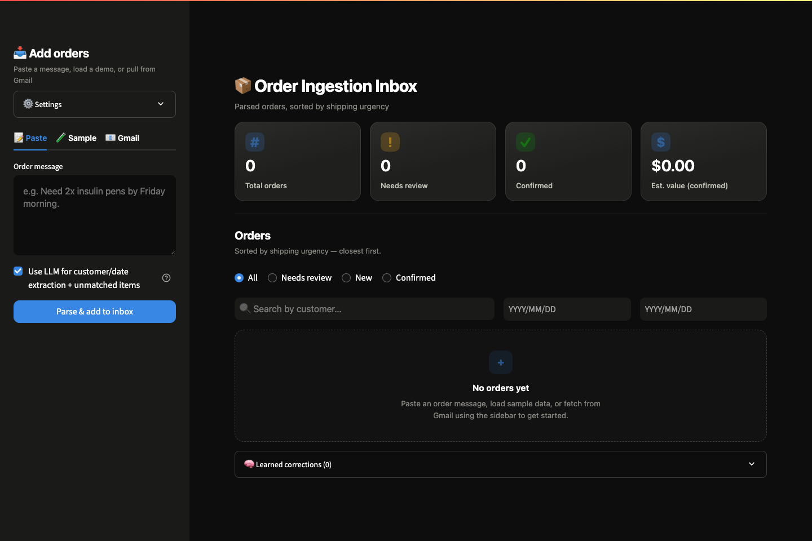
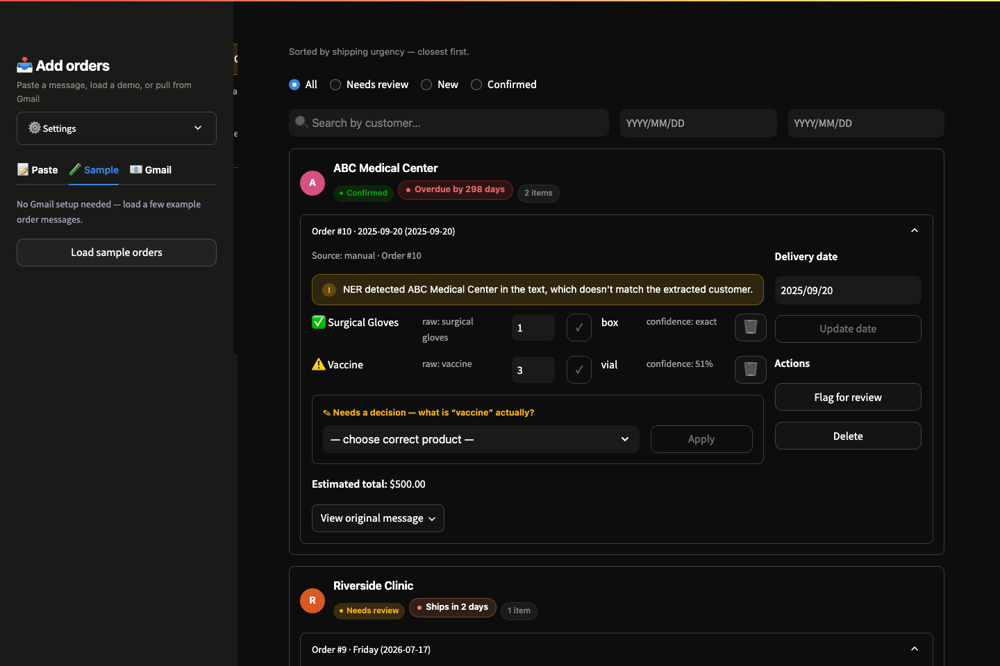
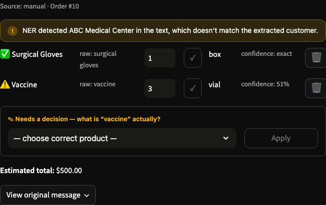

# AI Order Ingestion

Turns free-text order messages — pasted, or pulled straight from Gmail — into
a structured, reviewable order book, and exports confirmed orders in an
ERP-ready format. Built for the messy, real-world case: a customer types
"send me 2 oxygen tanks and 20 N95 masks by tomorrow evening" and someone on
the other end needs that to become a line-itemed purchase order, fast, without
silently guessing at the parts it isn't sure about.

**[▶ Watch the 2-minute demo](order-ingestion-demo.mp4)**

## Try it in 60 seconds

No API keys required for the basic demo path — regex extraction and fuzzy
product matching work standalone.

```bash
git clone <this-repo-url>
cd order-ingestion
pip install -r requirements.txt
python -m spacy download en_core_web_sm   # optional, enables the NER cross-check
streamlit run app/app.py
```

Open the app, go to the **Sample** tab in the sidebar, click **Load sample
orders**, and you'll have a populated inbox in a few seconds — no Gmail
credentials, no Gemini key, nothing else to configure.



## What it actually does

- **Regex extraction** pulls quantity / unit / product spans out of free-text
  messages. Fast, deterministic, no API cost, and it's the first pass on
  every message regardless of whether an LLM key is configured.
- **Fuzzy product normalization** (rapidfuzz, with a stdlib fallback) maps
  messy product mentions onto a small canonical catalog and scores the
  confidence of that match.
- **Gemini** is used only for the fields regex can't handle reliably —
  customer name and delivery date — and as a fallback when a product doesn't
  match the catalog with any confidence at all. It's never used for the bulk
  of item extraction; that stays regex-first by design (see below).
- **spaCy NER cross-check**: an independent, genuinely pretrained
  named-entity model tags organizations and dates in the raw text and
  cross-checks them against what the regex/Gemini stage extracted.
  Agreement raises confidence; disagreement gets flagged for review. This is
  the actual "entity recognition" component — scoped to customer/date, since
  spaCy's general-purpose NER isn't trained on medical-supply nouns and would
  just add noise there.
- **Self-improving product catalog**: correcting a flagged item in the UI —
  or a confident Gemini fallback match — is stored as a learned mapping. The
  next order using that exact phrasing resolves automatically, without
  another LLM call.
- **Confidence-based review flagging**: any order with a low-confidence
  product match, an NER disagreement, or a missing customer/date is flagged
  for human review instead of being silently guessed and shipped.
- **Gmail order-intent gating**: fetching from Gmail doesn't turn every
  newsletter and notification into a garbage order. Each email has to clear
  a keyword check *and* produce a confidently-matched item (or pass a
  targeted LLM check for the ambiguous middle case) before it becomes an
  order candidate. Already-imported messages are tracked by Gmail message ID
  so re-fetching doesn't create duplicates.
- **ERP-shaped export**: confirmed orders download as JSON or CSV mapped
  onto a purchase-order schema (PO number, SKU, line items, unit price) —
  the structure a real ERP import would expect.
- **Persistence** (SQLite): parsed orders live in a running order book with
  status (new / needs review / confirmed), editable quantities and delivery
  dates, and a searchable, filterable inbox sorted by shipping urgency.



### The review flow

Low-confidence matches don't get silently resolved — they surface as a
specific, actionable decision:



## Measured accuracy

Not an unverified claim — run it yourself:

```bash
python app/eval/run_eval.py
```

Against the 15-message hand-labeled test set in `app/eval/test_orders.py`
(regex + normalization only, no LLM):

| Metric | Score |
|---|---|
| Item extraction — Precision | 93.8% |
| Item extraction — Recall | 88.2% |
| Item extraction — F1 | 90.9% |
| Delivery date accuracy | 93.3% (14/15) |

Re-run with `--use-llm` to include Gemini-based customer/date extraction
(needs `GEMINI_API_KEY`). The eval script exists precisely so these numbers
can be tracked over time, not asserted once and forgotten.

## Design decisions

**Regex first, LLM only where regex genuinely can't do the job.** Item
extraction — quantity, unit, product — stays entirely regex + fuzzy-match,
even when a Gemini key is configured. That's not a cost-cutting shortcut;
it's the more reliable tool for the job. A fixed pattern is fast, free, and
its failure modes are predictable and testable (that's what the eval suite
is for). Customer name and delivery date, by contrast, show up in too many
free-form shapes for a fixed pattern — "next Friday," "before month-end,"
"ASAP" — so those two fields go to an LLM. The product catalog match is the
one exception: when fuzzy matching comes up empty-handed on a real product
the catalog just doesn't know ("O2 bottles" instead of "oxygen cylinder"),
a single targeted Gemini call resolves it, and the result is memorized so
that specific phrasing never needs the LLM again.

**Uncertain extractions get flagged, never silently guessed.** This is the
design decision that matters most. A regex-based pipeline *will* misparse
things — a casually-phrased quantity, an unfamiliar product name, a date
format it's never seen. The alternative to handling that honestly is
pretending it didn't happen: picking the most likely interpretation and
shipping it. This app does the opposite. Every item gets a confidence score;
every order gets a customer/date presence check and an independent NER
cross-check. Anything uncertain lands in "needs review" instead of "new,"
and the review UI is built to make that uncertainty specific and actionable
— not just "something's wrong here," but "here's the exact word, here's
what we think it might be, pick the right one." An order-ingestion tool
that's silently wrong 10% of the time is worse than one that's honestly
unsure 10% of the time and says so.

## Project structure

```
app/
  app.py              # Streamlit UI — the Orders Inbox
  pipeline.py         # regex parsing, normalization, confidence scoring, date resolution, Gemini calls
  ner_utils.py         # spaCy NER cross-check for customer/date
  storage.py           # SQLite persistence, learned-corrections table, quantity/date edits
  erp_export.py         # maps confirmed orders to a PO/ERP schema (JSON/CSV)
  gmail_client.py       # optional Gmail fetch, isolated so the app works without it
  sample_data.py        # example messages for a no-setup demo
  .streamlit/
    config.toml          # fixed dark theme, matches the custom CSS design system
  eval/
    test_orders.py        # hand-labeled test set
    run_eval.py            # measures real precision/recall/F1 against it
docs/
  screenshots/             # README screenshots
requirements.txt
```

## Known limitations

- **Word-form quantities aren't parsed** — "one box" doesn't match the same
  way "1 box" does, since extraction is tied to digit characters, not
  spelled-out numbers.
- **Very casual phrasing can still mis-associate quantity and product** —
  e.g. "can we get some thermometers? maybe 5 of them" ties the "5" to the
  wrong nearby phrase rather than "thermometers," mentioned earlier in the
  sentence.
- **spaCy's NER cross-check isn't trained on medical-supply vocabulary**, so
  it can produce false-positive "organization" tags on product codes (e.g.
  mistaking "N95" for a company name). This is a deliberate tradeoff — flag
  it for a human to glance at rather than silently trust an out-of-domain
  model — not a bug, but worth knowing about.
- **The product catalog, SKU codes, and price list are mock data**, standing
  in for a real ERP/catalog integration.
- **Gmail fetch reads plain-text email bodies only** — an order arriving as
  a PDF or image attachment isn't visible to the pipeline.
- **The Gemini free tier is genuinely limited** (a handful of requests per
  minute, ~20/day at time of writing) — heavy Gmail-fetch or clarification
  usage without a paid key will start failing closed (skipping rather than
  guessing) once quota's exhausted.
